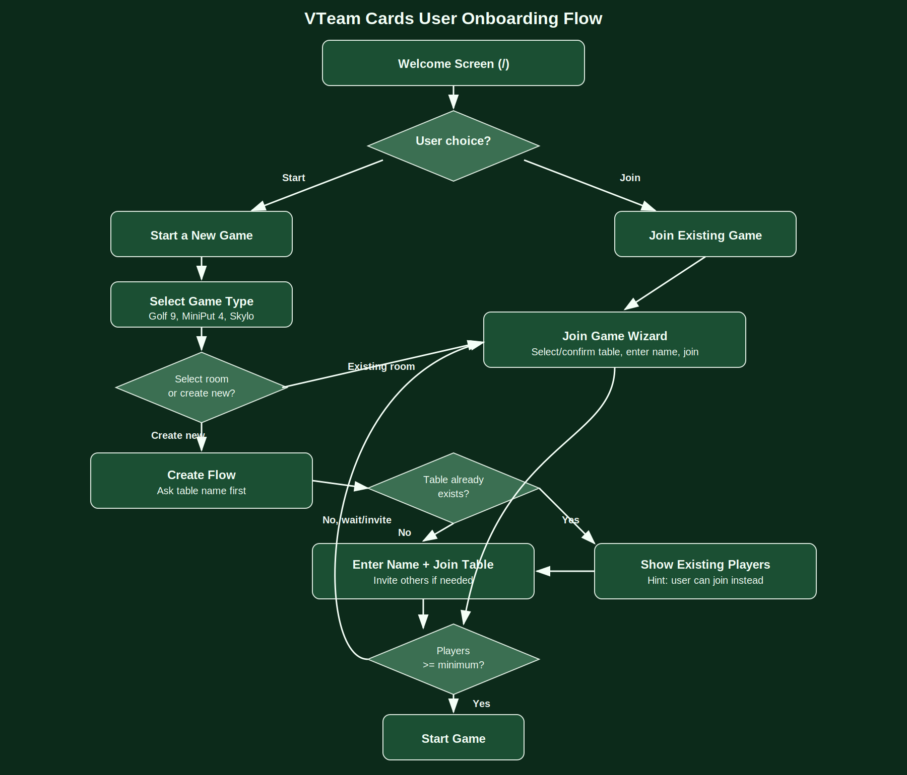

# User Onboarding Flow

This document describes how a user is onboarded into a multiplayer game session.

## Maintenance Rule

When onboarding rules or onboarding logic change, `onboarding_flow.svg` must be updated in the same change so the diagram always matches the documented flow.

## Entry Points

Users land on the **Welcome Screen** (`/`) and pick one of these:

1. **Start a New Game**
2. **Join an Existing Game**

## Start a New Game Path

1. User opens **Start Game Wizard** (`/start`).
2. User chooses game type:
   - Golf 9 Cards
   - MiniPut 4 Cards
   - Skylo
3. User chooses one of:
   - Select an existing table (room)
   - Create new table

### If user selects existing table

1. App opens **Join Game Wizard** with the selected room and game type.
2. User enters name and joins the table.
3. User waits for enough players.
4. When minimum players are available, user can start the game.

### If user selects create new table

1. App opens **Create flow** (`StartScreen` in create-room mode).
2. First step asks for **table name**.
3. While typing table name, app checks whether table already exists.
4. If table exists, app shows players already in that table and a hint that user can join instead of creating.
5. User enters name and joins/invites players.
6. When minimum players are available, user can start the game.

## Join an Existing Game Path

1. User opens **Join Game Wizard** (`/join`).
2. User selects table.
3. User enters name and joins.
4. User waits for enough players.
5. When minimum players are available, user can start the game.

## Core Decision Logic

1. **Room exists?**
   - Yes: show existing players and allow joining.
   - No: user creates room by joining it with first player.
2. **Enough players?**
   - Yes: enable Start Game.
   - No: keep waiting/inviting.
