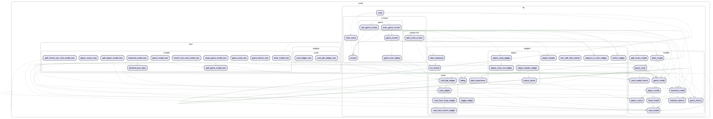

# VTeam Cards

A Flutter-based multiplayer card game application featuring multiple game modes and a comprehensive score keeping system.

## Features

### 🎮 Game Modes

- **9 Card Golf Game** (Classic French Cards)
  - 2 to 8 players
  - 3x3 card grid layout
  - 1 or 2 decks of cards
  - Match cards within rows and columns to reduce score

- **MiniPut Golf Game**
  - 2 to 8 players
  - 2x2 card grid layout
  - Simplified version of Golf game

- **SkyJo Game**
  - 2 to 8 players
  - 4x3 card grid layout (12 cards)
  - Custom card deck with unique scoring
  - 3-of-a-kind sets are discarded during play

- **Custom Game Mode**
  - Flexible configuration options

### 📝 Score Keeper

- Dedicated score tracking system for 9 Card Golf games
- Support for multiple players and rounds
- Keyboard input for efficient score entry
- Persistent score storage using shared preferences
- Visual indicators for winners (king crown) and losers
- Auto-add rounds functionality
- Player management with rename and delete options

### 🎯 Core Features

- **Drag and drop card interface**
- **Multiplayer support** with real-time Firebase integration
- **Game history tracking**
- **Player status management**
- **Offline play capability**
- **Cross-platform support** (Web, iOS, Android, macOS, Windows)
- **Splash screen** with professional branding
- **Responsive design** for various screen sizes
- **URL-based game joining** for easy invitations
- **Structured logging** for debugging and monitoring

## Game Mechanics & Scoring Systems

### 🎯 Active Evaluation (SkyJo)

- Cards are physically removed from players' hands during gameplay
- When a player forms sets of 3 cards with the same rank, those cards are discarded
- Player hands change composition throughout the game
- Scoring happens continuously as cards are eliminated

### 🏌️ Passive Scoring (Golf-Style Games)

- Card layout remains unchanged during gameplay
- Scoring calculated based on final revealed card positions
- Matched cards (same rank) don't contribute to final score
- Scoring occurs after all cards are revealed

### 📊 Score Keeper System

- Dedicated mode for tracking Scores
- Keyboard-based input for quick score entry
- Automatic round management
- Player statistics and winner identification
- Persistent data storage across app sessions

### Game Variants

#### French Cards (9 Card Golf)

- 3x3 grid (9 cards per player)
- Matches within rows and columns reduce score
- Matched set cards are not counted in final score
- 2 cards revealed at startup

#### MiniPut

- 2x2 grid (4 cards per player)
- Matches within rows and columns reduce score
- Simplified version of Golf game
- 1 card revealed at startup

#### SkyJo

- 4x3 grid (12 cards per player)
- 3-of-a-kind sets are discarded during play
- 2 cards revealed at startup
- Active scoring system

#### Custom

- Flexible configuration
- Customizable reveal counts and grid sizes

## Getting Started

### Prerequisites

- Flutter SDK
- Dart SDK
- Android Studio / VS Code with Flutter extension

### Installation

1. Clone the repository:

   ```bash
   git clone https://github.com/vteam-com/cards.git
   ```

1. Navigate to the project directory:

   ```bash
   cd cards
   ```

1. Install dependencies:

   ```bash
   flutter pub get
   ```

1. Run the app:

   ```bash
   flutter run
   ```

## Project Structure

```dart
lib/
├── main.dart                 # App entry point and routing
├── models/                   # Data models and business logic
│   ├── app_theme.dart       # App theming and styling
│   ├── card_model.dart      # Card representation
│   ├── game_model.dart      # Game state management
│   ├── golf_score_model.dart # Score keeper data model
│   ├── player_model.dart    # Player information
│   └── constants.dart       # App-wide constants
├── screens/                  # UI screens
│   ├── main_menu.dart       # Main navigation menu
│   ├── game/                # Game-related screens
│   └── keepscore/           # Score keeper screens
├── widgets/                  # Reusable UI components
│   ├── cards/              # Card-related widgets
│   ├── player/             # Player interface components
│   └── input_keyboard.dart # Custom keyboard widget
└── utils/                   # Utility functions
```

### Key Components

- **Firebase Integration**: Real-time multiplayer functionality
- **Offline Support**: Play without internet connection
- **Custom Keyboard**: Optimized input for score entry
- **Responsive Design**: Adapts to different screen sizes
- **State Management**: Robust game state handling

## Firebase Setup

To enable multiplayer functionality:

1. Enable Firebase experiments:

   ```bash
   firebase experiments:enable webframeworks
   ```

2. Update `firebase_options.dart` with your Firebase project details, or:

   ```bash
   flutterfire configure
   ```

3. The app supports offline play when Firebase is not available.

## Technology Stack

- **Flutter**: Cross-platform UI framework
- **Dart 3.9.2**: Programming language
- **Firebase**: Real-time database and authentication
- **Firebase Auth**: Anonymous user authentication
- **Shared Preferences**: Local data persistence
- **The Splash**: Professional splash screen implementation
- **Logger**: Structured logging system with multiple levels and test silencing

### Development Tools

- **fcheck**: Code quality and magic number detection
- **lakos + graphviz**: Dependency visualization
- **flutter_launcher_icons**: Multi-platform icon generation

## Contributing

Contributions are welcome! Please feel free to submit a Pull Request.

## License

This project is licensed under the MIT License - see the [LICENSE](LICENSE) file for details.

## Acknowledgments

- Flutter team for the excellent framework
- Contributors and open-source projects that inspired this app

## Layer Dependency Diagram


## Graph Call

install

```dart pub global activate lakos```

```brew install graphviz```

run
```./graph.sh```


